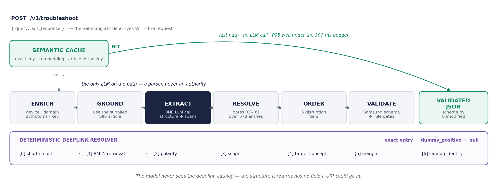

# Smart Guided Troubleshooting Engine
**Samsung PRISM Generative AI Hackathon, 3rd Edition (Y2026–27) — Theme 02**

Turns a vague Galaxy device complaint into a grounded, ordered, schema-valid troubleshooting
plan with verified in-app Settings deeplinks, checks whether the supplied article actually
covers what the customer described, then walks the customer through it one step at a time
and hands them to an agent with a full record when it cannot fix the problem.

| | |
|---|---|
| Theme | 02 · Smart Guided Troubleshooting Engine |
| Demo video | VIDEO_LINK_PENDING |
| Presentation | [`submission/`](submission/) |
| Release tag | `PRISM_GENAI_HACKATHON_Y2026` |

---

## What it does, in one example

A customer writes: *"My Galaxy S22 screen inputs are delayed and the touch responsiveness
is laggy."* Samsung's knowledge article for touchscreen issues arrives with the request.

1. **One LLM call** reads the article and returns the steps it contains, with the text
   each came from. It is a parser: it never sees the deeplink catalog, and the structure
   it fills in has no field a URL could go in.
2. **Deterministic code does everything else.** Each Settings step is matched to one of
   578 catalog entries through seven gates. `Enable Touch sensitivity` and `Disable Touch
   sensitivity` score 1.000 and about 0.93 on text similarity; the wrong one is rejected on
   polarity, not on score.
3. **The plan is ordered by disruption.** Checks you can do by hand first, Settings
   changes next, contacting support after that, and last-resort steps (restart, safe mode,
   factory reset) always last.
4. **Guided mode** shows one step at a time and asks whether it worked. Before the factory
   reset it stops and quotes Samsung's own warning from the article: *"Before proceeding,
   it is crucial to back up your personal data to avoid losing it."* If nothing works, an
   agent receives exactly what was tried and what is left.
5. **The engine checks the article fits the complaint.** The same LLM call lists each
   problem the customer described and whether the article addresses it, quoting the
   sentence that does. A "covered" claim counts only if that quote is a whole sentence
   of the article. The customer sees "This article covers 1 of the 2 problems you described";
   what it does not cover goes to the agent.
6. **A reworded complaint about the same article** is answered from a semantic cache in
   milliseconds with no LLM call.

---

## Results

Every figure is generated by the evaluation harness; none is typed into a document by
hand. Full tables: [`docs/metrics.md`](docs/metrics.md). Catalog findings:
[`docs/catalog_health.md`](docs/catalog_health.md). What is weak, and why:
[`LIMITATIONS.md`](LIMITATIONS.md).

**Deeplink resolution** (850 labelled steps, resolver only, so these do not depend on the
LLM provider):

| | Plain retrieval (V0) | Shipped (V4) |
|---|---|---|
| Wrong deeplinks | 31.8% | **1.2%** |
| Precision | 68.2% | **98.7%** |
| Accuracy@1 | 68.2% | **88.1%** |
| Confident answers on a catalog entry whose own description contradicts its label | 10 | **0** |

The last row is why precision is 98.7% and not 99.2%. The gold set is built from catalog
labels, so it scores an answer that follows a wrong label as correct: `Enable Grayscale`
(DL-0163) is described in the catalog as enabling **mono audio**. Gate [4] now refuses 50
such entries. Precision on the gold set went down; the answers got more correct.

**End to end over Samsung's 20 supplied rows, the cache, cost, guided-mode properties
and article fit** depend on the live provider and are in `docs/metrics.md` §1, §4, §6.1
and §6.2,
regenerated by `python -m evaluation.run_eval --provider gemini --rate-limit-rpm 12`.

---

## Quick start

Needs Python 3.11+ and Node 18+.

### Backend

**Windows (PowerShell)**
```powershell
python -m venv .venv
.venv\Scripts\Activate.ps1
pip install -r requirements.txt
python -m pytest                                              # 263 passed, 2 skipped
python -m uvicorn app.main:app --app-dir backend --port 8000
```

**Linux / macOS**
```bash
python3 -m venv .venv && source .venv/bin/activate
pip install -r requirements.txt
python -m pytest                                              # 263 passed, 2 skipped
python -m uvicorn app.main:app --app-dir backend --port 8000
```

No API key is needed for anything above: without one the service runs an offline
structural parser and says so in its logs. For the live model, copy `.env.example` to
`.env` and set `GEMINI_API_KEY`; `config.py` loads it at start-up.

The two skipped tests check the scale report and run once `python -m evaluation.scale`
has written one.

### Demo UI

```bash
cd frontend
npm install
npm run dev          # http://localhost:5173
```

It opens on the customer view with `row_21` selected, the fullest plan in the kit. Press
**Analyze Issue**, then **Guide me step by step**. Toggle **Engineer view** in the header
to see how each answer was reached. The UI calls `http://localhost:8000`; point it
elsewhere with `VITE_API_BASE`.

### Measurements

```bash
python -m evaluation.run_eval --provider gemini --rate-limit-rpm 12   # report.json + metrics.md
python -m evaluation.scale --max 10000                                 # metrics.md §8 + chart
python -m tools.catalog_health --provider gemini --rate-limit-rpm 12  # docs/catalog_health.md
```

`--rate-limit-rpm 12` keeps a 20-row run under Gemini's free tier of 15 calls a minute.
Each command also runs offline (drop `--provider`), with the provider named in its output.

### One request

```bash
curl -s localhost:8000/health
curl -s -X POST localhost:8000/v1/troubleshoot -H "Content-Type: application/json" \
  -d '{"query":"my galaxy phone touch screen is really laggy","siis_response":"Touchscreen issues\nTap Settings, then Display, then Touch sensitivity."}'
```

---

## Architecture



```
POST /v1/troubleshoot
  ├─ contracts.py        request validation (unknown fields rejected, not ignored)
  ├─ enrich.py           device / domain / symptoms / canonical query
  ├─ cache.py            L0 exact + L1 semantic, both partitioned by ARTICLE  ← fast path
  ├─ ground.py           the supplied siis_response, used directly (C1)
  ├─ llm/                ONE constrained call -> ir.Extraction   ← the only LLM on the path
  ├─ deeplinks.py        gates [0]-[6] over the 578-entry catalog
  ├─ ordering.py         rules-over-model categories + 5 disruption tiers
  ├─ assemble.py         Samsung-schema dicts + score formula
  └─ validate.py         rule gates + URL scrub + ContextDeeplinkResponse

/v1/guided/*             walks that validated plan one step at a time (guided.py)
```

### Resolver gates

```
[0] short-circuit   manual category (guide §4.1) or device operation -> null, no retrieval
[1] retrieval       BM25 over message + description + qna_description (never the URI)
[2] polarity        ON⇒onURL · OFF⇒offURL · VIEW⇒onClickURL · UPDATE⇒updateURL|onClickURL
[3] scope           reject a qualifier the step does not carry ("auto factory reset")
[4] target-concept  the step covers ≥ 60% of the candidate's subject, AND the candidate's
                    own description supports its label (catalog_audit.py)
[5] margin          top1 − top2 ≥ δ; a single survivor needs no comparison
[6] identity        URI ∈ catalog and every field byte-equal to the catalog record
```

Three legal outcomes and no fourth: an **exact catalog entry**, **`bixby://dummy_positive`**,
or **`null`**. Every design decision is cited to a numbered section of Samsung's materials
in [`docs/API_CONTRACT.md` §1 (C1–C12)](docs/API_CONTRACT.md).

### The semantic cache

The plan is a function of the complaint **and** the article supplied with it, so the
article is part of the key. Keyed on the complaint alone, the held-out false-positive rate
was 22%: five supplied rows are black-screen complaints with five different articles. With
the article in the key, a cross-article hit is structurally impossible.

A scale run (`evaluation/scale.py`, up to 10,000 synthetic scenarios recombined from the
supplied articles and labelled `SYN-*`) found three bugs that the 20-row evaluation could
not: eviction discarded the whole embedding matrix (fast path 24 s at 5,000 scenarios),
lookups checked the article after searching instead of searching within it (hit rate
falling to 8%), and the key cap held about 1,000 scenarios against a 10k target. All three
are fixed and covered by regression tests; `LIMITATIONS.md` §2.4 has the measurements.

---

## Guided mode

The theme is a *guided* troubleshooting engine, and a list of ten steps is not guidance.
Guided mode presents the validated plan one action at a time.

- **Order is the plan's.** It never reorders; critical steps stay last.
- **A safety gate before every critical step, enforced by the server.** Answering a
  critical step before confirming it returns `409`. Only a step that destroys data (factory
  reset, erase all) is shown a data-loss warning, and that warning is **quoted from the
  supplied article** near that step. With warnings quoted for every critical step, a
  restart was shown the factory-reset warning beside it in the article; that is fixed and
  tested. An article with no warning gets the gate and a line saying so, never text we
  wrote.
- **The plan's own support step is where an agent is offered.** Contacting support
  (tier 3) comes before last-resort steps (tier 4), so guided mode offers the handoff there
  instead of letting the customer walk alone into a reset.
- **The agent handoff** is assembled from the session with no model call: the complaint,
  device, article, every step with its outcome (fixed, did not help, could not do it,
  skipped, declined), and what is left. Declined and skipped steps are never reported as
  tried.

It does not learn from outcomes and it has no resolution rate, because that needs real
customers. `docs/metrics.md` §6.1 reports only what the engine guarantees.

---

## Article fit

Samsung's kit pairs some complaints with the wrong article: a screen-flashing complaint
arrives with *Email server not responding*. Every step drawn from such an article is
faithfully grounded and useless, and a lexical similarity signal could not detect it.

So the one extraction call also lists each problem the customer described (up to four)
and whether the article addresses it, with one sentence copied from the article as
evidence. The model is still a parser here, not an authority: `pipeline/article_fit.py`
believes a "covered" claim only when its quote is a whole sentence of the article
(verbatim, or after collapsing whitespace, curly quotes, dashes and case). A fragment, a
single word, an invented sentence or one carrying a URL is refused. A refused claim is
**unverified**, which is neither covered nor not covered: the model may be right and have
misquoted, so the customer is never told "not covered" on its strength.

| Fit | Meaning | What the customer sees |
|---|---|---|
| full | every described problem covered, with a verified quote | a short confirmation |
| partial | a mix of covered, not covered and unverified | each problem marked; guided mode passes the uncovered ones to the agent |
| none | the model judged every problem not covered | "this article does not seem to cover what you described", with an agent offered first |
| unknown | no problems reported (offline stub, older recordings), every claim unverified, or a cache hit on reworded words | nothing: no verdict is not a verdict |

A cache hit from a reworded complaint reports **unknown**: the plan is shared, but the
stored fit judged another customer's words, and no model read this one's. Only the same
words (a refresh, or guided mode starting from the plan just shown) get the stored fit
back, marked as replayed. The debug view shows the cold run's fit, labelled as such.

It lives in `meta.article_fit`; the graded `response` is unchanged, and a test asserts it
is identical with and without the fit. `docs/metrics.md` §6.2 compares the verdicts with
the four mismatched pairings Phase 0 identified.

## Catalog health

[`docs/catalog_health.md`](docs/catalog_health.md) is feedback on Samsung's
`deeplinks.json`, generated by `tools/catalog_health.py`: things no resolver can work
around.

- 54 labels cover more than one screen; `View Notification Settings` covers 21.
- 5 groups of entries are identical on every text field.
- 50 labels name a different screen from their own description (`Enable WiFi`, DL-0312,
  enables Mobile Hotspot).
- `Charging feedback` has an off link and no on link, so "turn on charging feedback" has
  no correct answer.
- Samsung's own articles send customers to Factory data reset, which has no catalog entry.

---

## API

| Endpoint | Source | Notes |
|---|---|---|
| `POST /v1/troubleshoot` | Theme 2 guide §5 | `{query, siis_response?}` → `{query, query_variations, response, meta}`. `response` alone validates against `schema.py`; `meta.article_fit` is ours. |
| `GET /health` | Theme 2 guide §5 | `503` until catalog and indexes are warm, then `200 {"status":"ok"}`. |
| `GET /metrics` | ours, non-spec | Per-stage latency, cache counters, guided-session counts, cost. |
| `POST /v1/troubleshoot/debug` | ours, non-spec | `{envelope, debug}`: the same pipeline plus enrichment, grounding, verified spans and the resolver trace, as a **sibling** of the graded response. |
| `GET /v1/samples` | ours, non-spec | The 20 supplied rows for the demo UI. |
| `POST /v1/guided/start` | ours, non-spec | Runs the pipeline and opens a session over its validated plan. |
| `GET /v1/guided/{id}` | ours, non-spec | The session view. |
| `POST /v1/guided/{id}/answer` | ours, non-spec | `{"outcome": "fixed" \| "not_fixed" \| "could_not_do" \| "skipped"}`. `409` on an unconfirmed critical step. |
| `POST /v1/guided/{id}/confirm` | ours, non-spec | `{"proceed": true \| false}`: the safety gate. |
| `POST /v1/guided/{id}/escalate` | ours, non-spec | Ends the session with an agent handoff. |

---

## Guarantees enforced by tests

| Guarantee | Test |
|---|---|
| `schema.py` unmodified; vendored copy identical | `test_contract.py` |
| Every emitted URI is in the catalog, field for field | `test_resolver.py`, `test_generality.py` |
| The masked URI is never matched on | `test_uri_is_never_part_of_the_match` |
| `manual` actions never carry a deeplink; `critical` ordered last | `test_row21_integration.py`, `test_generality.py` |
| Zero URL leakage, including the agent handoff | `test_zero_url_leakage`, `test_the_handoff_never_carries_a_url` |
| No fixture text hardcoded in `backend/app` | `test_no_fixture_text_is_hardcoded_in_backend_app` |
| No resolution on a label its own description contradicts | `test_no_resolution_in_the_gold_set_lands_on_an_unsupported_label` |
| A different article is never served from cache | `test_a_different_article_is_never_served_from_cache` |
| A critical step cannot be answered before it is confirmed | `test_a_critical_action_cannot_be_answered_before_it_is_confirmed` |
| Every safety-gate warning is verbatim from the article | `test_every_gate_quote_is_verbatim_from_the_supplied_article` |
| Guided mode walks exactly the graded plan | `test_guided_mode_does_not_change_the_graded_response` |
| A "covered" verdict needs a quote found in the article | `test_a_covered_claim_with_an_invented_quote_is_not_believed` |
| Article fit never changes the graded response | `test_the_graded_response_is_identical_with_or_without_the_fit` |

---

## Layout

```
data/                     Samsung-supplied and unmodified: schema.py (checksummed),
                          deeplinks.json (578), siis_responses.json (20), input.txt
  lexicons/               category, tier, scope, destructive-operation lexicons: DATA
backend/app/
  main.py  guided.py      the API, and guided mode over its validated plan
  pipeline/               enrich · cache · embeddings · ground · deeplinks ·
                          catalog_audit · article_fit · ordering · spans · assemble ·
                          validate
  llm/                    base · stub (offline) · replay · gemini
backend/tests/            263 tests; fixtures/ holds a recorded Gemini extraction
evaluation/               synthetic.py (gold set) · run_eval.py · scale.py · report.json
frontend/                 React + Vite: customer view, guided mode, engineer view
tools/                    catalog_health · demo_row21 · record_fixture_row21
docs/                     metrics.md · catalog_health.md · API_CONTRACT.md ·
                          PHASE0_REQUIREMENTS_ANALYSIS.md · architecture.png
submission/               the presentation
LIMITATIONS.md            what was cut, what is weak, and the evidence for each
```

## Tech stack

Python 3.11+, FastAPI, Pydantic v2, rank-bm25, NumPy, sentence-transformers
(`all-MiniLM-L6-v2`, with a scikit-learn TF-IDF fallback), Google Gemini 3.1 Flash-Lite at
temperature 0, pytest. Frontend: React 18 and Vite, no component library. No Redis, FAISS,
cross-encoder or agent framework: each was evaluated and rejected with a reason in
`docs/PHASE0_REQUIREMENTS_ANALYSIS.md` §7.

## Known limitations

The main ones, each with its evidence in [`LIMITATIONS.md`](LIMITATIONS.md):

- **Article fit is a model judgment with a verified quote, not proof.** The check
  confirms the quote is a whole sentence of the article, not that it truly addresses the
  problem. It is measured against 4 mismatched pairings in 20 rows: a small sample, with
  verdicts that are the team's own.
- **10 wrong answers remain on the gold set**, mostly a short catalog subject matching
  inside a longer step ("Zen Mode" → `View Screen mode`).
- **The gold set is derived from catalog labels, not human-labelled.**
- **Guided mode has no resolution rate and does not learn.**
- **The repair loop and a dense retrieval leg were cut**, with the measurements that would
  reverse each decision.
